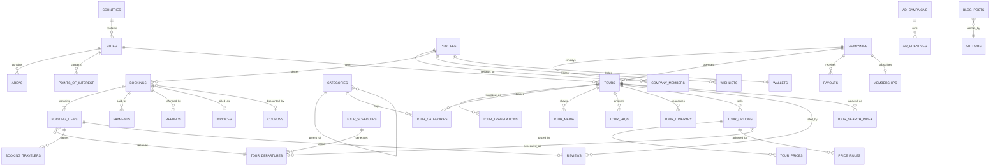

# Architecture

## 1. Shape of the system

TravelHub Gulf is a read-heavy marketplace with a small, sharply
transactional core. Roughly 99% of traffic is anonymous catalog browsing that
should never touch a database, and 1% is checkout that must be correct under
concurrency. The architecture follows that split.

```
                    ┌──────────────────────────────────────┐
   Crawlers ───────▶│  Vercel Edge (proxy.ts)              │
   Travellers ─────▶│  locale · session · rate limit · geo  │
                    └───────────────┬──────────────────────┘
                                    │
              ┌─────────────────────┼─────────────────────┐
              ▼                     ▼                     ▼
      ┌───────────────┐   ┌──────────────────┐   ┌────────────────┐
      │ Static / ISR  │   │ Server Actions   │   │ Route Handlers │
      │ catalog pages │   │ checkout, review │   │ webhooks, feeds│
      └───────┬───────┘   └────────┬─────────┘   └───────┬────────┘
              │                    │                     │
              ▼                    ▼                     ▼
      ┌────────────────────────────────────────────────────────┐
      │ Redis (Upstash): read-through cache · rate limits       │
      └────────────────────────┬───────────────────────────────┘
                               ▼
      ┌────────────────────────────────────────────────────────┐
      │ Postgres (Supabase): RLS · row locks · search index      │
      │ pg_cron: hold reaper · popularity · sitemap warm         │
      └────────────────────────────────────────────────────────┘
```

Three rules hold the whole thing together:

1. **Catalog pages are static.** Rendered at build or on-demand with ISR,
   revalidated by tag when a supplier edits a tour. Traffic spikes cost
   bandwidth, not database connections.
2. **Money moves only through Postgres transactions.** Availability is a row
   lock, not an application-level check. Two people clicking the last seat at
   the same millisecond is a solved problem in the database, and an unsolvable
   one in Node.
3. **The browser never states a price.** It states a choice. The server prices
   it. A tampered payload gets the correct total back, not a discount.

## 2. Folder structure

```
travelhub-gulf/
├── src/
│   ├── app/
│   │   ├── [locale]/                    # ar | hi | ur — `en` is unprefixed
│   │   │   ├── (marketing)/             # home, partner, about, static pages
│   │   │   ├── (catalog)/
│   │   │   │   ├── [country]/
│   │   │   │   │   ├── page.tsx                        # country hub
│   │   │   │   │   └── [city]/
│   │   │   │   │       ├── page.tsx                    # city hub
│   │   │   │   │       ├── things-to-do/page.tsx       # primary money page
│   │   │   │   │       ├── attractions/[poi]/page.tsx
│   │   │   │   │       ├── areas/[area]/page.tsx
│   │   │   │   │       └── [category]/
│   │   │   │   │           ├── page.tsx                # city × category
│   │   │   │   │           └── [modifier]/page.tsx     # indexed long tail
│   │   │   │   ├── tour/[slug]/page.tsx
│   │   │   │   ├── operator/[slug]/page.tsx
│   │   │   │   └── search/page.tsx
│   │   │   ├── (booking)/checkout/[reference]/
│   │   │   ├── (content)/travel-guide/
│   │   │   ├── (auth)/sign-in | sign-up | callback/
│   │   │   ├── account/                 # traveller area
│   │   │   ├── dashboard/               # supplier area
│   │   │   └── admin/                   # platform area
│   │   ├── api/
│   │   │   ├── webhooks/{stripe,tap,hyperpay}/route.ts
│   │   │   ├── cron/{expire-holds,popularity,payouts,sitemap}/route.ts
│   │   │   ├── search/autocomplete/route.ts
│   │   │   └── ads/{serve,impression}/route.ts
│   │   ├── sitemaps/[kind]/route.ts
│   │   ├── robots.ts
│   │   ├── llms.txt/route.ts
│   │   └── styles/design-tokens.css
│   ├── features/                        # vertical slices, not layers
│   │   ├── search/{components,hooks,server,types}
│   │   ├── booking/
│   │   ├── reviews/
│   │   ├── ads/
│   │   └── dashboard/
│   ├── components/{ui,tours,layout,seo}
│   ├── actions/                         # 'use server' — one file per mutation
│   ├── services/                        # pure business logic, no React
│   ├── schemas/                         # zod — the only trusted boundary
│   ├── lib/{supabase,seo,cache,i18n,payments,ai}
│   ├── hooks/
│   └── types/
├── supabase/
│   ├── migrations/                      # numbered, forward-only
│   ├── seed/
│   └── functions/                       # edge functions (email, AI jobs)
├── docs/
└── e2e/                                 # Playwright: checkout, RLS, SEO tags
```

Why `features/` **and** `components/`: anything owned by one product area
lives in its slice and can be deleted with it. `components/ui` holds only
things with no domain knowledge. The test is simple — if deleting a feature
would leave a component orphaned, that component belongs inside the feature.

## 3. Entity relationships



The two decisions worth defending:

**Translations are rows, not JSONB columns.** `tour_translations(tour_id,
locale, …)` lets Arabic have its own slug, its own meta description and its
own unique index. A JSONB blob cannot enforce "one slug per locale", and the
slug uniqueness constraint is what keeps two cities from colliding at
`/ar/دبي`.

**Departures are materialised, not computed.** A recurrence rule cannot be
locked. `tour_departures` gives every sellable slot a row with a capacity
counter, so `SELECT … FOR UPDATE` is all that stands between us and an
oversold desert safari on New Year's Eve.

## 4. API surface

| Kind | Path | Purpose |
|---|---|---|
| Server Action | `createBookingAction` | Price, hold, persist, redirect to pay |
| Server Action | `getQuoteAction` | Live total for the booking panel |
| Server Action | `submitReviewAction` | Post-travel review, verified by booking |
| Route Handler | `POST /api/webhooks/stripe` | Signature-verified capture → confirm |
| Route Handler | `GET /api/search/autocomplete` | Trigram suggest, 40 ms budget |
| Route Handler | `GET /api/ads/serve` | House ad selection with frequency cap |
| Route Handler | `POST /api/cron/expire-holds` | Reclaims abandoned checkouts, 1/min |
| Route Handler | `GET /sitemaps/[kind]` | Chunked, cached, hreflang-aware |
| PostgREST | `supabase.from('tour_search_index')` | Filtered catalog reads under RLS |
| RPC | `hold_seats`, `confirm_booking`, `resolve_price`, `nearby_tours` | Transactional core |

Public REST for affiliates (`/api/v1/*`, key-authenticated, 120 req/min) is
deliberately deferred to Phase 3 — a public contract is much harder to change
than an internal one.

## 5. Authentication and authorisation

```
Sign-up ──▶ Supabase Auth (email OTP · Google · Apple · phone OTP)
              │
              ├─▶ trigger on_auth_user_created → profiles row (role: traveler)
              │
              ▼
        JWT in httpOnly cookie
              │
   ┌──────────┴───────────┐
   ▼                      ▼
Edge proxy      Postgres RLS
 · refresh session    · auth.uid() on every row
 · gate /dashboard    · is_company_member(company_id)
 · gate /admin        · is_admin()
```

Authorisation is enforced in the database, not the router. The edge proxy
gate is a courtesy that saves a render; if it were bypassed entirely, RLS
would still return zero rows. Any check that exists only in React is not a
security control — it is a UI affordance.

Role escalation is closed explicitly: the `profiles` update policy carries
`with check (id = auth.uid() and role = auth_role())`, so a traveller cannot
promote themselves by writing to their own row.

Three service-role callers are permitted, and no others: payment webhooks,
cron jobs, and admin mutations that have already passed an explicit role
check. The client that bypasses RLS is never imported into a component.

## 6. Caching and revalidation

| Surface | Strategy | Invalidated by |
|---|---|---|
| Tour page | ISR, 1 h | `revalidateTag('tour:{id}')` on supplier edit |
| City / category | ISR, 30 min | tag on tour publish or unpublish |
| Homepage rails | ISR, 15 min | CMS publish |
| Search facets | Redis, 10 min | tag `facets:{city}` |
| Availability | Redis, 60 s | write-through on hold and confirm |
| Sitemaps | Redis, 1 h + CDN 24 h | nightly cron |

Availability gets the shortest window on purpose: a stale price is an
annoyance, a stale seat count is an oversell.
